## 数据绑定
一旦更新了data中的某个属性数据，所有界面上直接使用（如{{msg}}）或间接使用（如computed计算属性）了此属性的节点都会更新。

* 初始化显示：页面（表达式/指令）能从data读取数据显示（编译/解析）
  new MVVM() => compile解析指令 => updater初始化视图
* 更新显示：更新data中的属性数据——>页面更新

## 数据劫持
* 1）数据劫持是vue中用来实现数据绑定的一种技术
* 2）基本思想：通过defineProperty()来监视data中所有属性（任意层次）数据的变化，一旦变化就去更新界面

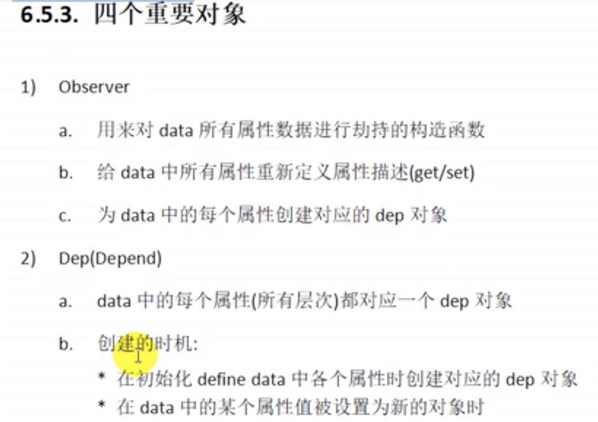
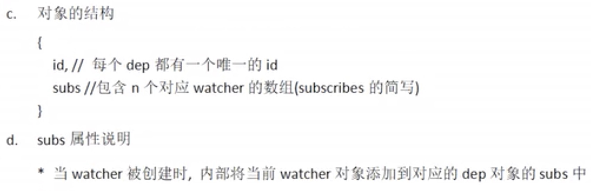
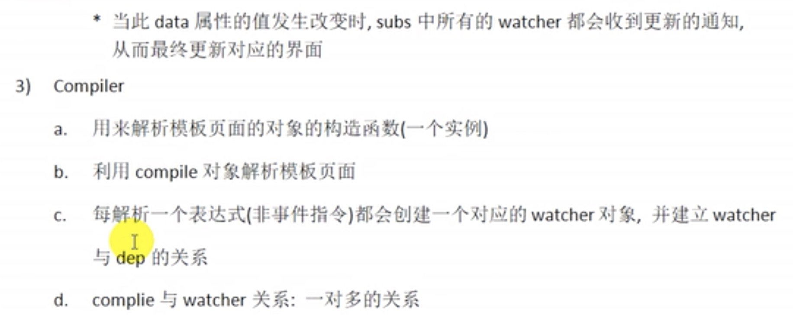
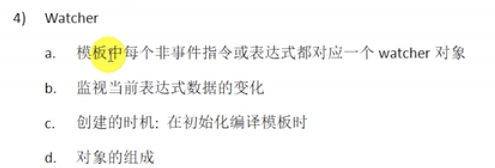
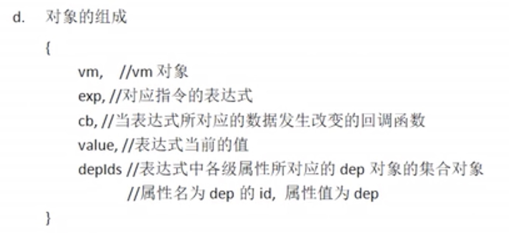
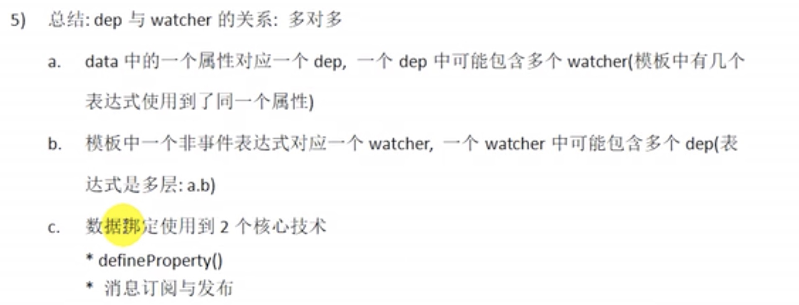

**MVVM原理图分析**
订阅者即Watcher，即初始化的编译/解析大括号/一般指令时创建 界面中的{{name}} v-text="name"等
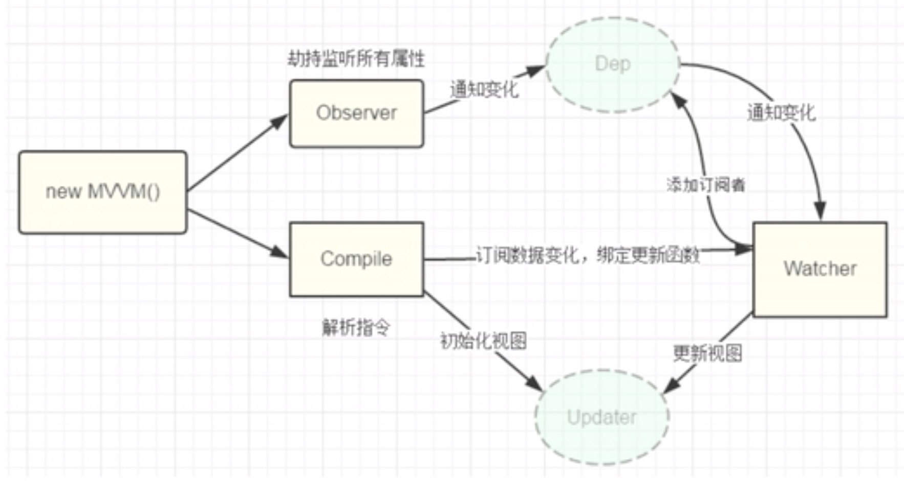
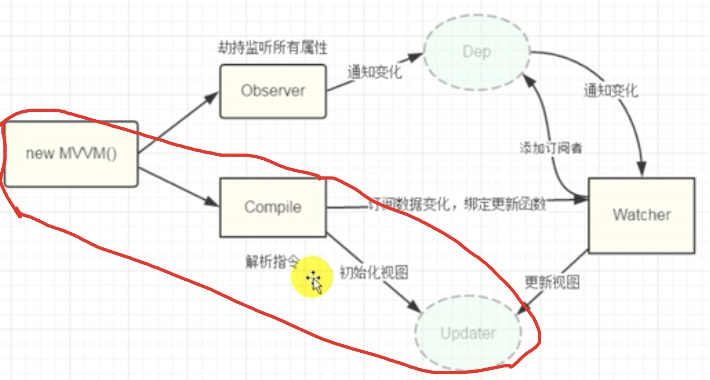

MVVM
modal：模型，数据对象（data）
```
data: {

}
```
view： 视图，模版页面
```
<div></div>
```
viewModal：视图模型（vue的实例），即以下代码中的vm实例
```
const vm = new Vue({
    el: '#app',
    data: {
        name: ''
    }
});
```
**Dep和Watcher**
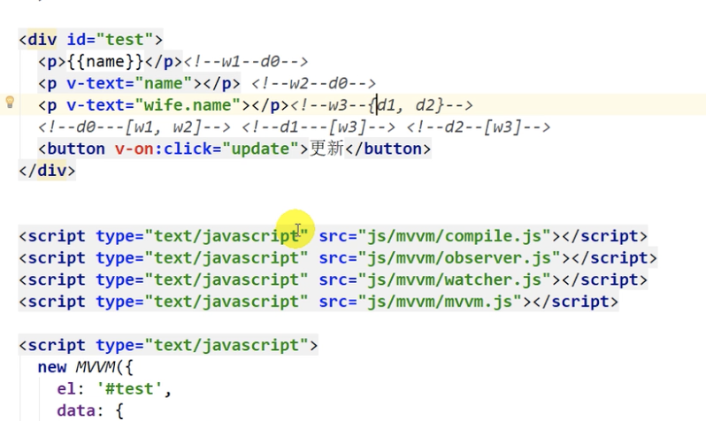

```
data: {
    name: 'mm',
    wife: {
        name: 'lmm',
        age: 18
    }
}
```

```
    Dep
        它的实例什么时候创建？
            初始化时给data的属性进行数据劫持时创建的
        个数？
            与data中的属性一一对应
        Dep的结构？
            id: 标识(对data中的属性，包括所有层次中的属性进行唯一标识)
            如：
            data:{
                name: 'mm', // id 1
                like: { // id 2
                    a: 1, // id 3
                    b: 2 // id 4
                }
            }
            <!-- 只要需要通过标识去取一个值的时候，可以用对象存，所以depIds用的是对象存储，而dep的subs没有用对象存，用的是数组，因为只需简单的遍历即可，当然subs用对象也行 -->
            subs: [] n个相关的watcher的容器

    Watcher
        它的实例什么时候创建?
            初始化的编译/解析大括号/一般指令时创建
        个数？
            与模版中表达式（不包括事件指令）一一对应
        Watcher的结构？
            this.cb = cb; // 用于更新界面的回调
            this.vm = vm; // vm
            this.expOrFn = expOrFn; // 对应的表达式
            <!-- 只要需要通过标识去取一个值的时候，可以用对象存，所以depIds用的是对象存储，而dep的subs没有用对象存，用的是数组，因为只需简单的遍历即可，当然subs用对象也行 -->
            this.depIds = {}; // 相关的n个dep的容器对象
            this.value = this.get(); // 当前表达式对应的value

    vm.name = 'mm' => data中的name属性值变化 => name的set()调用 => dep => 通知所有相关的watcher => updater

Dep与Watcher直接的关系
    什么关系？
        多对多的关系
        data属性（如name） ——> Dep ——> n个Watcher（模版中有多个表达式使用了此属性会有n个watcher）(属性在模版中多次被使用，如: <p>{{name}}</p>  <div>{{name}}</div> v-text="name"
        表达式——>Dep——>n个Dep()
        a.b ——> W ——>n个Dep(多层表达式：a.b.c n=3)
    如何建立的？
        vm.name = 'abc' ——>data中的name属性值变化——>name的set()调用——>dep——>相关的所有watcher
    ——>cb(回调函数)——>updater
        data中属性的get()中建立
    什么时候建立？
        初始化的解析模块中的表达式创建Watcher对象时
```
## 手画MVVM
初始化显示阶段的MVVM：

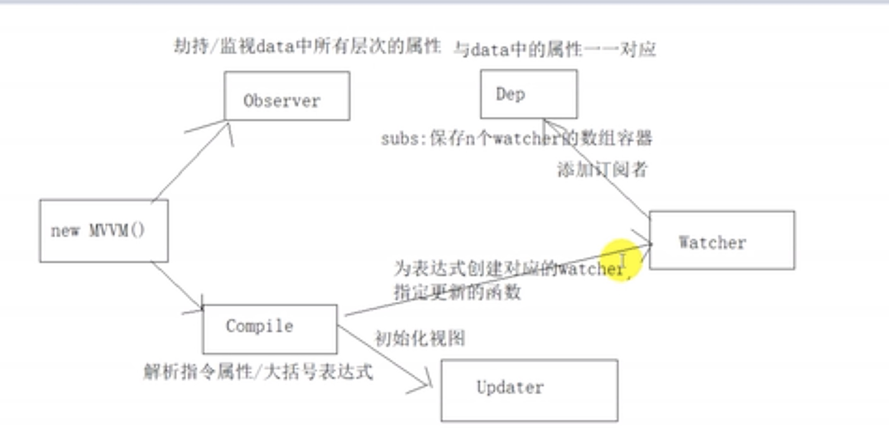

更新显示阶段：红色线表示的是更新显示的整个mvvm过程
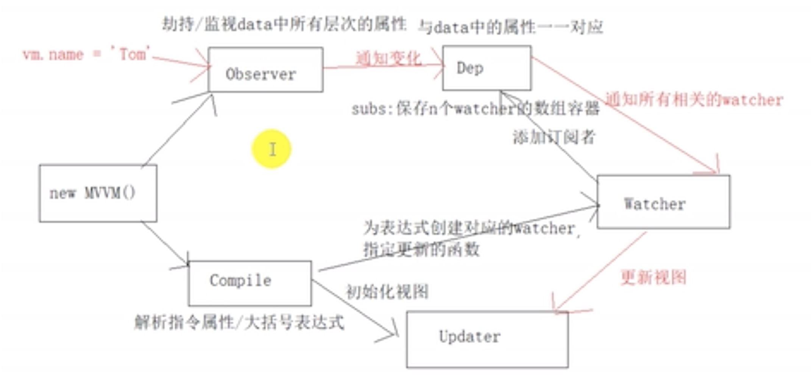

# 双向数据绑定
三步：
1. model -> view，即：data: {name: mm} -> `<input :value="name"/>`
2. 给元素添加input事件监听：ele.addEventListener('input', fn......)
3. view -> model：view改变model会触发set()，即又会重新触发model -> view，这样就实现了双向绑定。所以核心还是model -> view

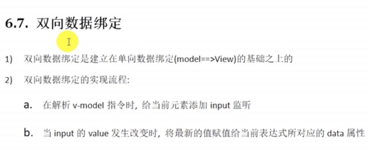