## Vuex：全局的、共享的
多个组件共享的状态可以放在Vuex中管理，即多个组件共享的data属性；
组件内部使用的状态，不存在共享，不需要放在Vuex中管理

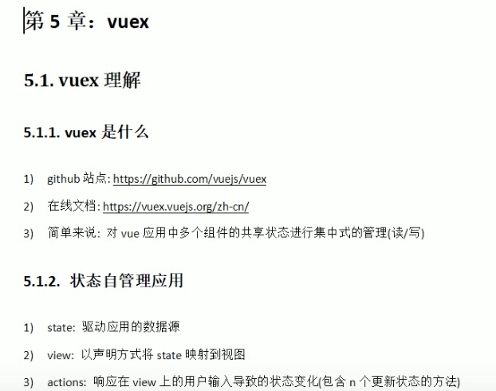
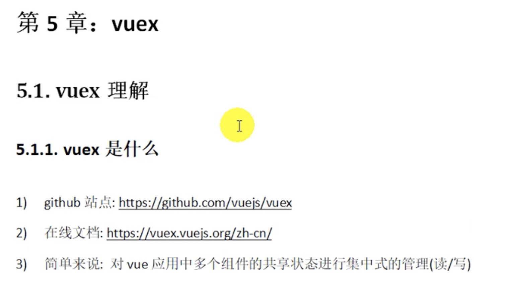

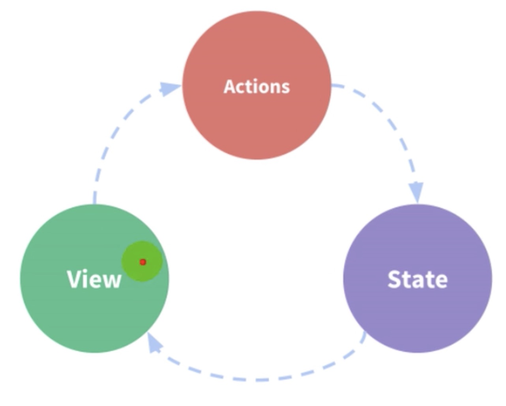
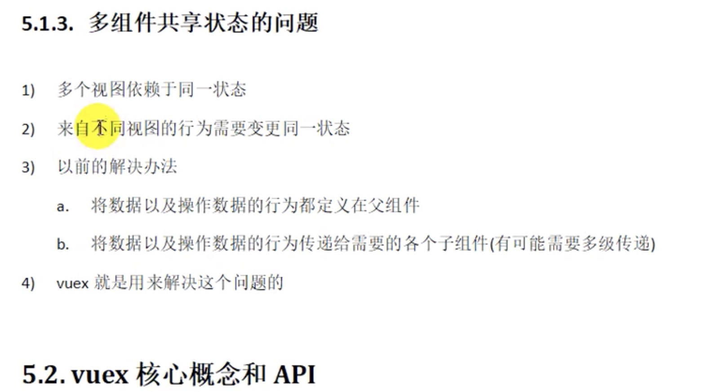
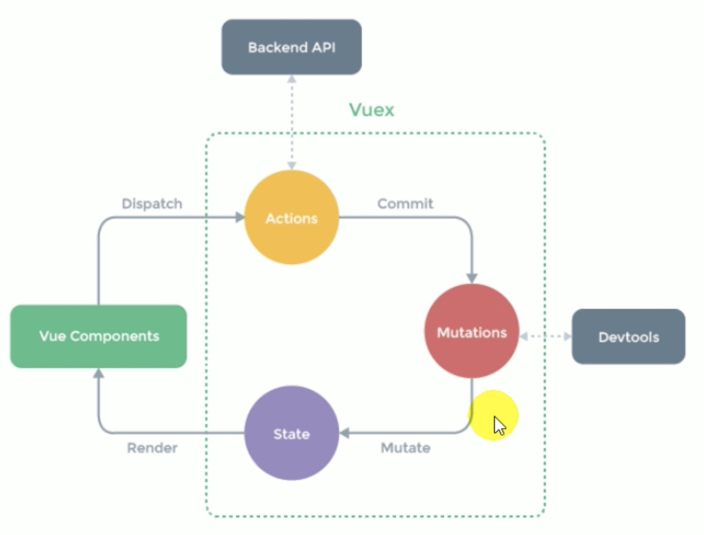
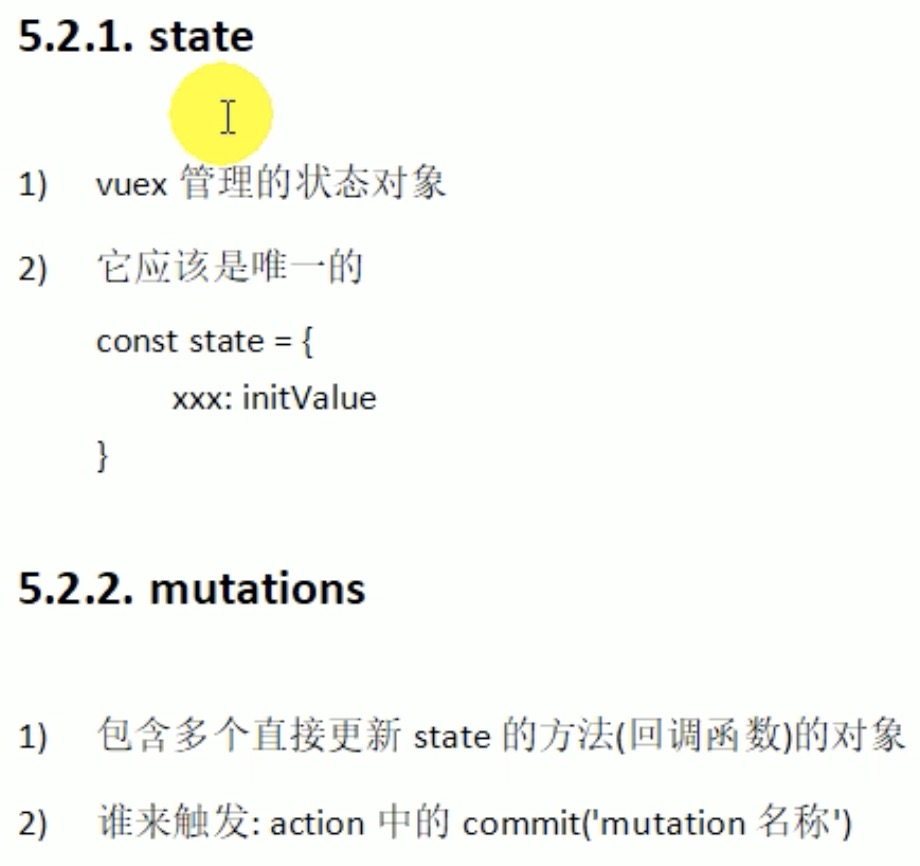
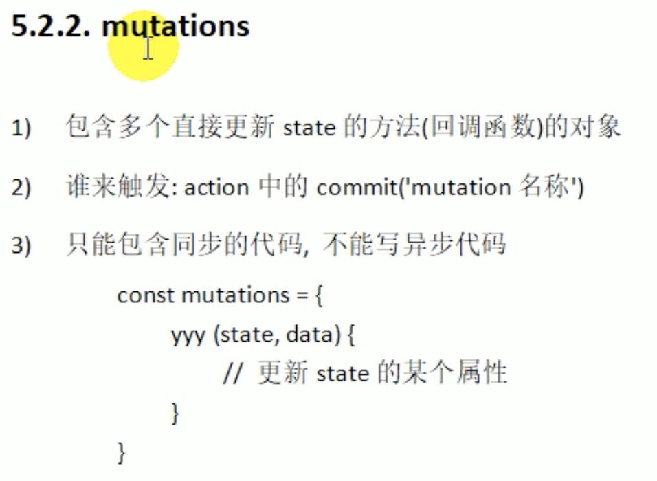
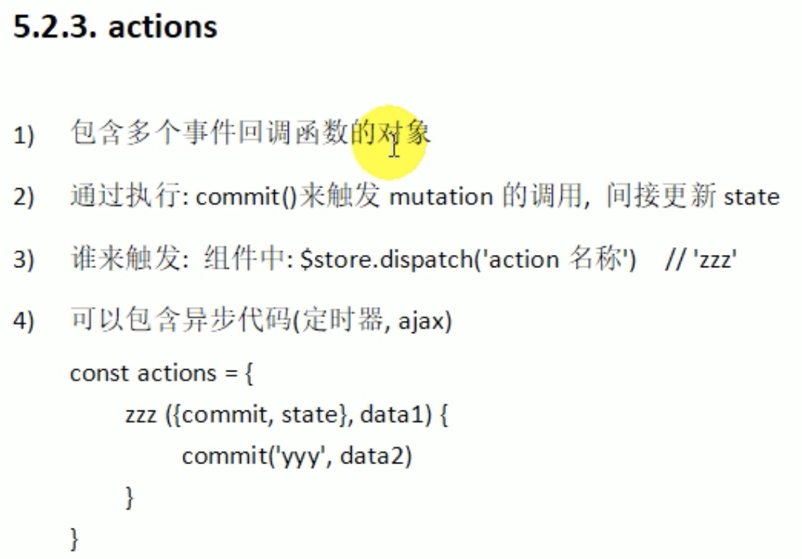
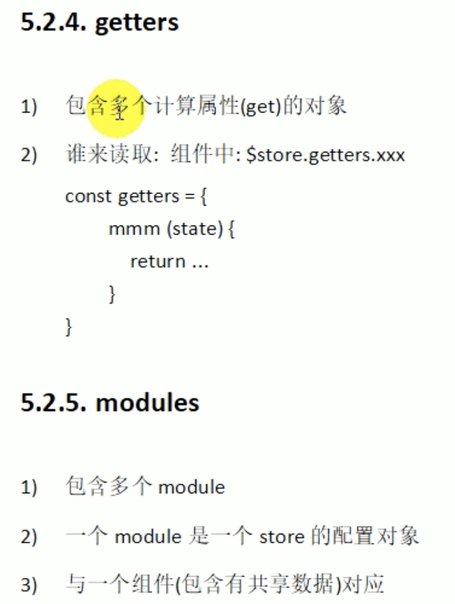
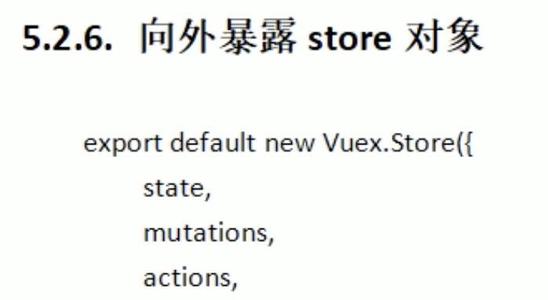
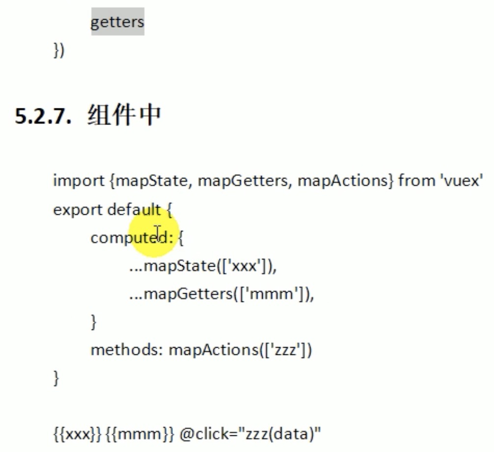
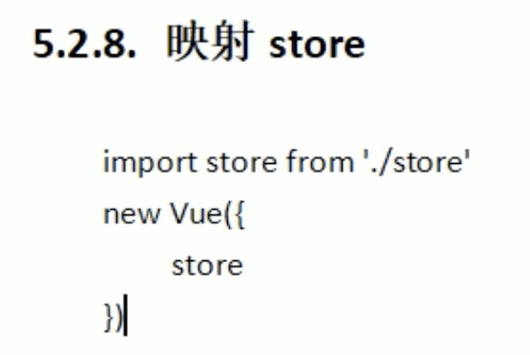
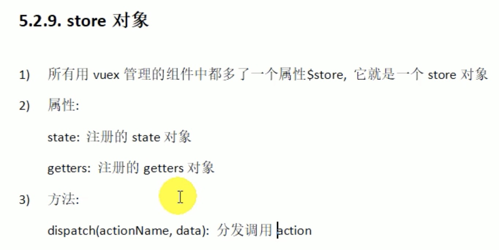

```javascript
// ===app.js===
import store from './store'
new Vue({
    el: '#app',
    components: {App},
    template: '<App/>',
    // 这行语句使得所有组件对象都多了一个属性：$store，在组件中直接通过this.$store可取到该属性
    store
})


// ===store.js===
// 以下四个对象正常项目开发中会放在四个文件里
// 状态对象
const state = {
    // 第1步 初始化状态，相当于组件中的data: {count:0}
    count: 0
}
// 包含多个更新state函数的对象
// 包含多个由action触发去直接更新状态的方法的对象
const mutations = {
    // 增加的mutation 第4步
    INCREMENT(state){
        state.count++;
    },
    // 减少的mutation
    DECREMENT(state){
        state.count--;
    }
}
// 包含多个对应事件回调函数的对象
// 包含多个接受组件通知触发mutation调用间接更新状态的方法的对象
const actions = {
    // 增加的action 第3步
    increment({commit}) {
        // 提交增加的mutation
        commit('INCREMENT');
    },
    // 减少的action
    decrement({commit}) {
        commit(DECREMENT);
    },
    // 注意：异步的action
    incrementAsync({commit}) {
        // 在action中直接执行异步代码
        setTimeout(() => {
            // 提交增加的mutation
            commit('INCREMENT');
        },
        1000);
    }
}
// 包含多个getter计算属性函数的对象
// 包含所有基于store的getter计算属性的对象
const getters = {
    // 不需要调用该方法，只需要读取属性值会默认调用这个方法，和对象的get方法一样，对象的get方法不会调用，取值时默认调用
    evenOrOdd(state) {
        return state.count % 2 === 0 ? '偶数' : '奇数'
    }
}


export default new Vue.Store({
    // 状态对象
    state,
    // 包含多个更新state函数的对象
    mutations,
    // 包含多个对应事件回调函数的对象
    actions,
    // 包含多个getter计算属性函数的对象
    getters
})

// ===组件===
<template>
    <div>
        <p>{{count}} ： {{evenOrOdd}}</p>
    </div>
</template>
import {mapState, mapGetters, mapActions} from 'vuex';
computed: {
    // mapState()返回值：{count() {return this.$store.state['count']}}
    ...mapState(['count']),
    // mapGetters()返回值：{evenOrOdd() {return this.$store.getters['evenOrOdd']}}
    ...mapGetters(['evenOrOdd'])
},
// methods里的简写方式
methods: {
    ...mapActions(['increment', 'decrement', 'incrementAsync'])
}
// methods里的繁杂写法（代码不优雅的写法）
methods: {
    // 增加 第2步
    increment() {
        // 通知vuex去增加
        // 触发store中对action调用
        this.$store.dispatch('increment'); 
    },
    // 减少
    decrement() {
        // 通知vuex去增加
        // 触发store中对action调用
        this.$store.dispatch('decrement'); 
    },
    // 异步增加
    incrementAsync() {
        this.$store.dispatch('incrementAsync');
    }
}
```

## Vuex原理图
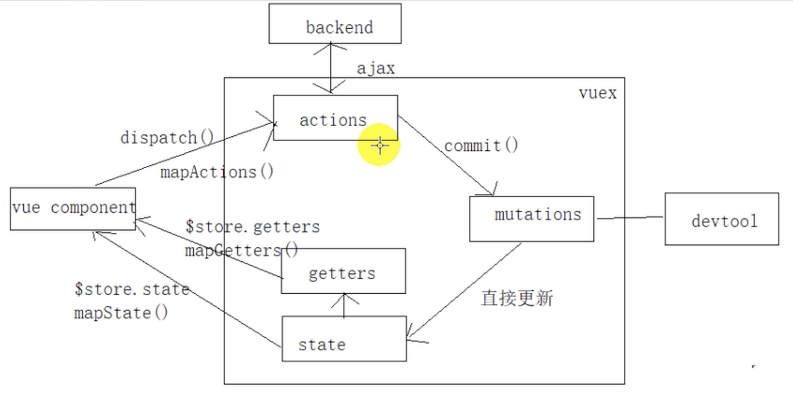